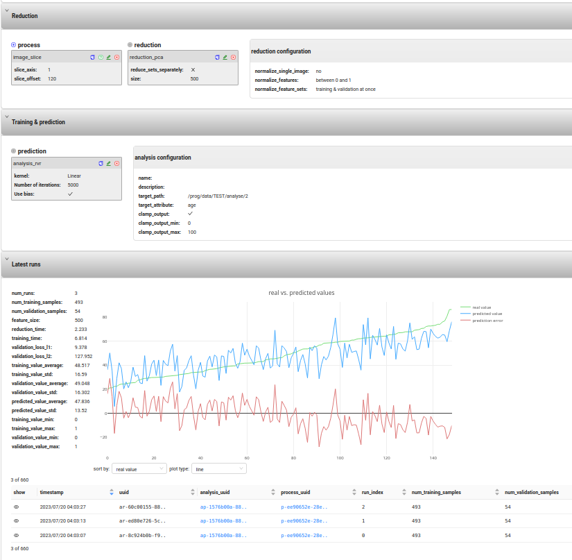

# BrainAGE Designer

**Brain** **A**ge **G**ap **E**stimation framework with browser-based user interface.



Some of the features:

- all experiments are controlled from the web-UI
- supports arbitrary preprocessing pipelines
- fine control over analysis / model creation
- all experiments are stored to database for revisiting them later


## Installation

### Requirements

- [Python](https://www.python.org/) 3.8 or later
- [MongoDB](https://www.mongodb.com/) 3.6 or later 
- [Matlab Runtime](https://www.mathworks.com/products/compiler/matlab-runtime.html) v93 (optional)

### Download

Using the git command-line tool:

```shell
cd /my/projects  # or where you want to place it
git clone https://github.com/defgsus/brainage-designer.git
cd brainage-designer
git checkout development-frontend
```

or you can download [a zip file](https://github.com/defgsus/brainage-designer/archive/refs/heads/development-frontend.zip)
and extract it.

### Running on localhost

```shell
# create new python environment
python -m venv env
# activate     
source env/bin/activate
# install python packages
pip install -r requirements.txt
pip install https://github.com/JamesRitchie/scikit-rvm/archive/master.zip
```

[Install MongoDB](https://www.mongodb.com/docs/manual/installation/)

Start server and worker:

```shell
./start-server.sh
```

visit [http://localhost:9009](http://localhost:9009)

#### Configuration

The local setup can be configure by creating a `.env` file
in the root directory. It can have the following entries:

```shell
# enable debugging mode (mainly for web-server, more text output)
BAD_DEBUG=true

# -- directories --

# the root path below which everything can be accessed
BAD_DATA_PATH=/home/me
# temporary directory to use
TEMP_PATH=/tmp/brainage-designer

# -- matlab --

# path to the matlab runtime 
MATLAB_PATH=/home/me/MATLAB_Runtime/v93
# path to the matlab-based CAT12 toolbox
CAT12_PATH=/home/me/CAT12.8.1_r2042_R2017b_MCR_Linux

# -- API server --

# change the address of the API (and frontend) server
SERVER_HOST=localhost
SERVER_PORT=9009

# -- mongodb --

# rename the database
DATABASE_NAME=brainage-designer
# location of the mongodb server
DATABASE_HOST=localhost
DATABASE_PORT=27017
# to handle authentication with mongodb
DATABASE_USER=brainage-user
DATABASE_PASSWORD=brainage-password
```


## Installation via 'Docker' 

Install a recent version of [Docker Engine](https://docs.docker.com/engine/install/) 
or the **Docker Desktop** if you can't help it.

#### Ubuntu 18.04
```shell
mkdir tmp
cd tmp
wget https://download.docker.com/linux/ubuntu/dists/bionic/pool/stable/amd64/containerd.io_1.6.9-1_amd64.deb
wget https://download.docker.com/linux/ubuntu/dists/bionic/pool/stable/amd64/docker-ce-cli_20.10.9~3-0~ubuntu-bionic_amd64.deb
wget https://download.docker.com/linux/ubuntu/dists/bionic/pool/stable/amd64/docker-ce_20.10.9~3-0~ubuntu-bionic_amd64.deb
wget https://download.docker.com/linux/ubuntu/dists/bionic/pool/stable/amd64/docker-compose-plugin_2.6.0~ubuntu-bionic_amd64.deb

sudo dpkg -i *.deb

cd ..
rm -r tmp/
```

### run with docker compose

Copy the file [docker-compose-EXAMPLE.yml](docker-compose-EXAMPLE.yml) to `docker-compose.yml` and
replace the `<PATH-TO-...>` entries:

    <PATH-TO-DATA>:   the top-most directory where all data read and written to
    <PATH-TO-MATLAB>: the directory of the matlab (v93 / R2017) runtime
    <PATH-TO-CAT12>:  the directory of the CAT12 standalone version

```shell
docker compose build
docker compose up
```
and visit [http://localhost](http://localhost).


### run single docker images

```shell
# ./build-frontend.sh

docker build --tag brainage-designer .
docker run -ti -p 80:9009 brainage-designer
```


# Development

### prepare environments

```shell
# for python the typical..
python -m venv env
source env/bin/activate
pip install -r requirements.txt

# for frontend
cd frontend
yarn
```


### run server on localhost

In project root: 
```shell
# transpile with yarn & parcel
./build-frontend.sh
# start the python server
./start-server.sh
```
and visit [http://localhost:9009](http://localhost:9009).

### run server on localhost with hot-reloading

In project root:
```shell
# start the python server
./start-server.sh
```

In another shell in `frontend` directory:
```shell
yarn start
```
and visit [http://localhost:1234](http://localhost:1234).
